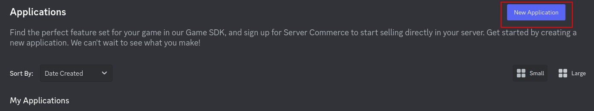
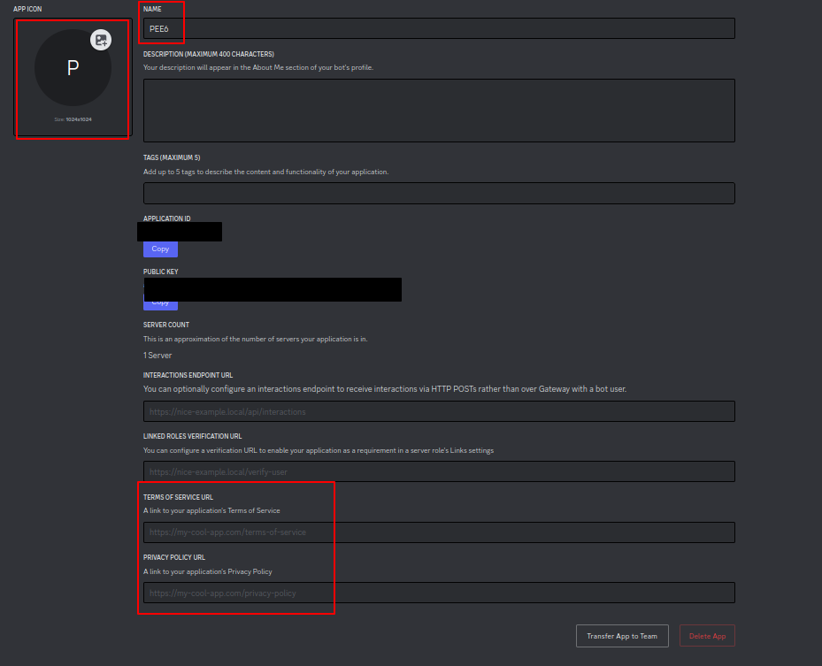
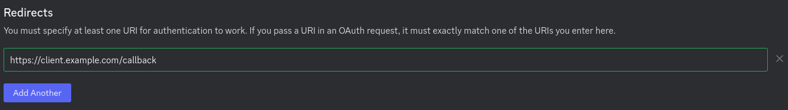
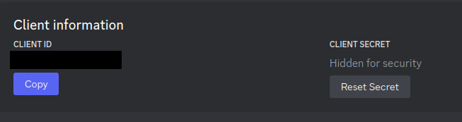

---
layout:
  title:
    visible: true
  description:
    visible: false
  tableOfContents:
    visible: true
  outline:
    visible: true
  pagination:
    visible: true
---

# 💬 Configuring Discord

🔐 Login

Head on over to the [Discord Dev Portal](https://discord.com/developers/applications) and create a new application.

<figure><figcaption><p>Creating a new application</p></figcaption></figure>

Give it a name and create it under **Personal** (or a team it doesn't really matter).

Set your app's name and icon, this is what users will see on the login screen. Set a TOS and Privacy Policy URL if your host has them, these will also be shown at login.

<figure><figcaption><p>Discord App Info</p></figcaption></figure>

Next go to **OAuth2**, then add a **Redirect**. This redirect should be the URL to your client (the public one, set as `oauth2.link`) with `/callback`.

Example:&#x20;

<figure><figcaption><p>Example redirect</p></figcaption></figure>

Next copy your `Client ID` and `Client Secret`.

<figure><figcaption><p>Client ID and Secret</p></figcaption></figure>

Configure everything in `config.json` now:


```json
      "oauth2": {
        "_comment": "Go to https://discord.dev/ and create an application to set these up.",
        "id": "APPLICATION_ID",
        "secret": "YOUR_SECRET",
        "link": "https://YOUR_DOMAIN",
        // Rest of file
```


## 💰 J4R (Join 4 Rewards)

This method works with Discord which checks if an user has joined a server listed in settings.json\


```json
      "j4r": {
        "enabled": true,
        "ads": [
          {
            "name": "Example server 1",
            "invite": "https://discord.gg/example",
            "id": "000000000000000000",
            "coins": 25
          },
          {
            "name": "Example server 2",
            "invite": "https://discord.gg/example",
            "id": "000000000000000000",
            "coins": 200
          }
        ]
      },
```

`"name"`: Name of the server listed in J4R. It can be the name you want not neccessary the server's name\
\
`"invite"`: Here goes the Discord invitation to the server to add to J4R. Make sure you create a permanent invite\
\
`"id"`: The server id you want to add here\
\
`"coins"`: Number of coins that users will get once they join to the server

You can create as many J4Rs as you want. By default, we add two slots but you can add infinite slots
