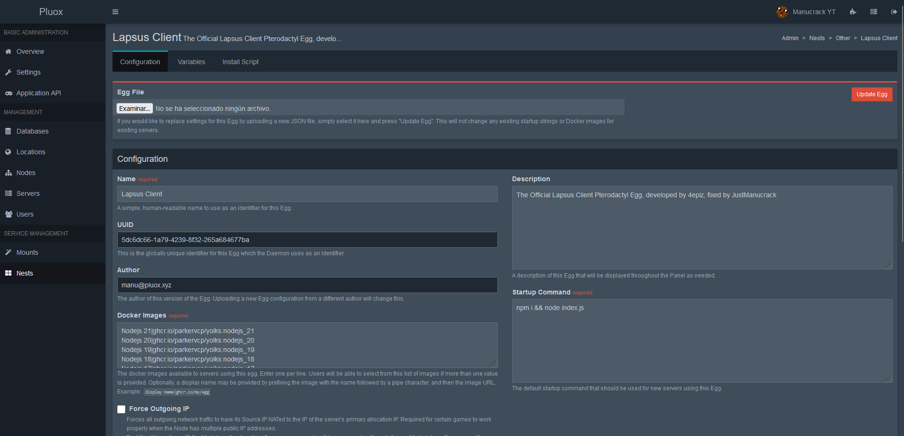

---
layout:
  title:
    visible: true
  description:
    visible: false
  tableOfContents:
    visible: true
  outline:
    visible: true
  pagination:
    visible: false
---

# 🥚 Using the egg

**If you want to install Lapsus Client on a Pterodactyl Server you can use our official egg**

## ⬇️ Download the egg

Go to [this Github Repository](https://github.com/lapsusdevs/egg) and download the .json file which is the egg

## 🪧Import it to the Pterodactyl Panel

Access the Admin Area and go to Nests -> Import Egg (upload it from your local and select a Nest Group) and click Import

<figure><figcaption><p>This is what you should see once you follow the steps mentioned before</p></figcaption></figure>

## ➕ Create a new server

Go to Servers -> Create New -> now set a name, an owner and node and it's important to select the egg you have imported (ig you can create a server on Pterodactyl)\


You can also select which version you want to install

<figure><figcaption></figcaption></figure>

Go to the Server Page and wait until the installation process finishes. Once it finishes, follow the next step.

## ⚙️ Editing essential settings

Now open `settings.json` and edit the file as you need, we recommend changing the following (options are explained more in the [settings.json.md](../reference/settings.json.md "mention") reference):


```json
"name": "Lapsus Client",
  "logo": {
    "url": "/assets/img/logo_background.png"
  },
```



```json
"website": {
    "port": 8000,
    "secret": "changeme"
  },
```



```json
"pterodactyl": {
    "domain": "https://panel.yourdomain.com",
    "key": "ptla_",
    "account_key": "ptlc_"
  },
```



```json
"oauth2": {
    "_comment": "Go to https://discord.dev/ and create an application to set these up.",
    "id": "",
    "secret": "",
    "link": "http://localhost:8080",
    [...]
```


<figure><figcaption><p><strong>On the Discord Developer Portal, your Redirect must end with "/callback"</strong></p></figcaption></figure>

## 💉 Starting the Client

Now click the   button if the server hasn't started yet, if you have set everything correctly, Lapsus Client will show something like this:

<figure><figcaption><p>If you see this, congratulations! You have setup everything correctly to use Lapsus Client</p></figcaption></figure>

Now login using the URL you setup and you will be ready to login for the first time!

<figure><figcaption><p>Lapsus Client - Login page</p></figcaption></figure>

## ✔️ All done!

To see your next steps, continue on to the following pages:


[configuring-discord.md](configuring-discord.md)



[settings.json.md](../reference/settings.json.md)



[extensions-and-themes.md](extensions-and-themes.md)



[configuring-a-reverse-proxy.md](configuring-a-reverse-proxy.md)

